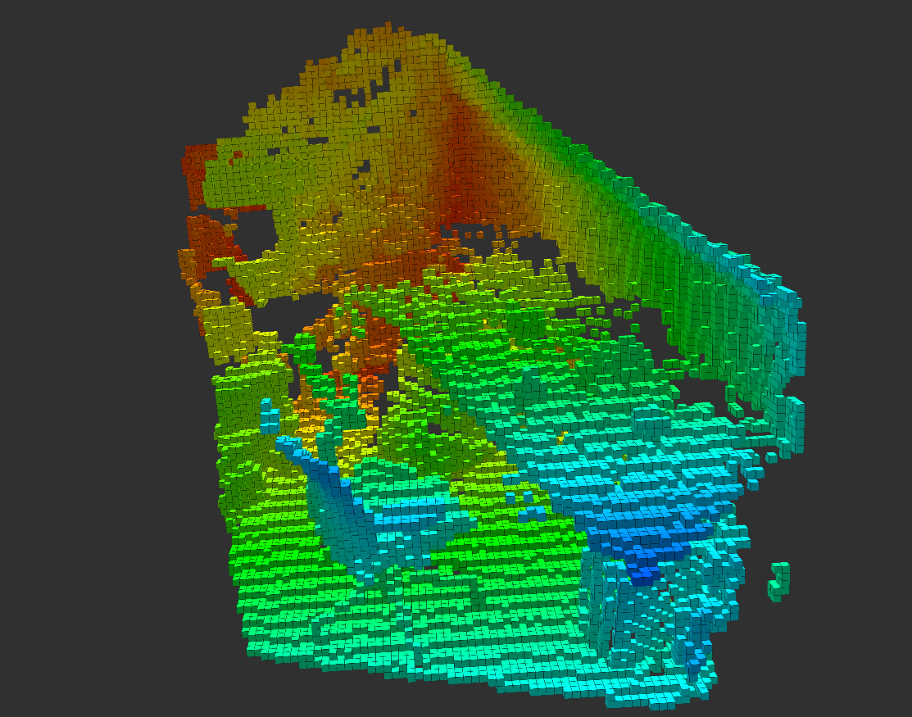

# Octomap Depth Mapping for ROS2

`octomap_depth_mapping` is a ROS2 package to create octomaps from depth images



## Dependencies

- ROS2 Foxy or above
- Octomap
- OpenCV
- cv_bridge
- message_filters
- CUDA Toolkit (optional, for [details](#Cuda))

## Usage

You can clone this repository into your `<your-ros2-workspace>/src` folder and build the workspace

```bash
git clone https://github.com/berkealgul/ros2-octomap-depth-mapping.git
```
Before building this package, decide [cuda](#Cuda) usage and change your [distance function](#Distance-Function) if necessary

To launch the package (dont forget to source the package)
```bash
ros2 launch octomap_depth_mapping mapping_launch.py
```

## Node: octodm_node

Main mapping and publishing node

### Published Topics
|Name|Type|Description|
|:---:|:---:|---|
|`octomap_fullmap`| octomap_msgs/Octomap | generated octomap (orginated at 0,0,0) |

### Subscribed Topics 
|Name|Type|Description|
|:---:|:---:|---|
|`depth/rect` | sensor_msgs/Image | rectified depth image see [here](#About-Image-Data) for details |
| `pose` | geometry_msgs/PoseStamped | pose of the camera relative to world origin |
 
### Parameters
|Name|Default|Type|Description|
|:---:|:---:|:---:|---|
|`sensor_model/fx` | 524.0 | double | Camera fx calibration value |
|`sensor_model/fy` | 524.0 | double | Camera fy calibration value |
|`sensor_model/cx` | 316.8 | double | Camera cx calibration value |
|`sensor_model/cy` | 238.5 | double | Camera cy calibration value |
|`sensor_model/hit` | 0.7 | double | Hit probability of octomap |
|`sensor_model/miss`| 0.4 | double | Miss probability of octomap |
|`sensor_model/min` | 0.12 | double | Minimum probability of empty cell |
|`sensor_model/max` | 0.97 | double | Maximum probability of occupied cell |
|`encoding` | mono16 | string | Input image encoding |
|`resolution` | 0.05 | double | Octomap resolution |
|`padding` | 1 | int | Padding size between pixel during  image projection |
|`width` | 640 | int | Input image width |
|`height` | 480 | int | Input image height |
|`frame_id` | map | string | Octomap ROS frame id |
|`filename` |  | string | file path for saving & loading octomap (optional) |
|`save_on_shutdown` | false | bool | If true octomap is saved to `filename` before shutting down |

### Remappings
|Name|Default|Description|
|:---:|:---:|---|
|`image_in` | depth/rect | Subscribed image topic |
|`pose_in` | pose | Subscribed camera pose topic |
|`map_out` | octomap_fullmap | Published octomap topic |

### Services
|Name|Type|Description|
|:---:|:---:|---|
|`reset` | std_srvs/srv/Empty | Deletes octomap nodes |
|`save` | std_srvs/srv/Empty | Saves octomap into `filename` locatiob|
|`get_octomap` | octomap_msgs/srv/GetOctomap | Returns current state of octomap |

## About Image Data

This package supports 8 and 16 bit greyscale images

`CV_U8C1` and `CV_16UC1` in OpenCV [literature](http://ninghang.blogspot.com/2012/11/list-of-mat-type-in-opencv.html) 

`mono8` and `mono16` in cv_bridge [literature](http://docs.ros.org/en/diamondback/api/cv_bridge/html/c++/namespacecv__bridge.html#a49fedf7e642d505557b866f6e307a034)

In addition, images are assumed to be rectified beforehand; thus no distortion parameters are needed for this package

## Cuda

By default cuda is not supported. In order to compile with cuda, uncomment [line](https://github.com/berkealgul/ros2-octomap-depth-mapping/blob/1a8d29c2004f0891bf81fbf1937c6d8b9ced48cf/CMakeLists.txt#L18) at `CMakeLists.txt` 

```cmake
# uncomment this line to use cuda
#set(USE_CUDA TRUE)
```

This package developed with cuda toolkit 11.4 and supports with [gpu compute capabilities](https://developer.nvidia.com/cuda-gpus) 3.5 and above

To learn more about cuda device compatibility [look at this link](https://docs.nvidia.com/deploy/cuda-compatibility/index.html)

## Distance Function
Every raw depth value in input image needs to be converted into meters before processing further. In this package, this is done at `depth_to_meters` function at 
[depth_conversions.hpp](https://github.com/berkealgul/ros2-octomap-depth-mapping/blob/master/include/depth_conversions.hpp) file. It it developed according to Kinect
v2 depth camera, thus you may need to change this function(or cuda function) for the sensor model you have.

```cpp
inline double depth_to_meters(ushort raw_depth) 
{
    if(raw_depth > 6408)
    {
        return ((2.5-0.9)/(15800.0-6408.0))*raw_depth;
    }        

    return 0;
}
```
For cuda users
```cpp
__device__ __forceinline__ void depth_to_meters(ushort raw_depth, double& depth) 
{
    if(raw_depth > 6408)
    {
        depth = ((2.5-0.9)/(15800.0-6408.0))*raw_depth;
    }        
    else
        depth = 0;
}
```

